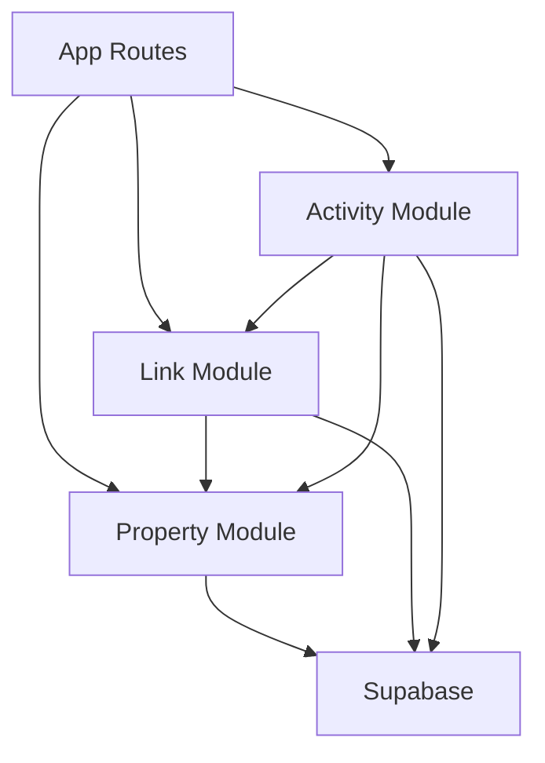

# SwipeLink Estate - Architecture

## System Design

SwipeLink Estate is a modular real estate platform combining property management with a Tinder-like browsing experience.

```
┌─────────────────────────────────────────┐
│           Client Browser                 │
├─────────────────────────────────────────┤
│         Next.js App Router               │
│  ┌────────────┬──────────┬───────────┐ │
│  │   Public   │  Agent   │   Link    │ │
│  │   Routes   │  Routes  │  Routes   │ │
│  └────────────┴──────────┴───────────┘ │
├─────────────────────────────────────────┤
│           Service Layer                  │
│  ┌────────────┬──────────┬───────────┐ │
│  │  Property  │   Link   │  Activity │ │
│  │  Service   │ Service  │  Service  │ │
│  └────────────┴──────────┴───────────┘ │
├─────────────────────────────────────────┤
│         Data Layer (Supabase)            │
│  ┌────────────┬──────────┬───────────┐ │
│  │ Properties │  Links   │ Activities│ │
│  │  Sessions  │  Storage │    RLS    │ │
│  └────────────┴──────────┴───────────┘ │
└─────────────────────────────────────────┘
```

## Module Structure

```
lib/
├── modules/
│   ├── property/
│   │   ├── README.md
│   │   ├── index.ts
│   │   ├── property.service.ts
│   │   ├── property.types.ts
│   │   └── __tests__/
│   ├── link/
│   │   ├── README.md
│   │   ├── index.ts
│   │   ├── link.service.ts
│   │   ├── link.types.ts
│   │   └── __tests__/
│   └── activity/
│       ├── README.md
│       ├── index.ts
│       ├── activity.service.ts
│       └── __tests__/
├── shared/
│   ├── formatters/
│   ├── validators/
│   └── utils/
└── config/
    └── supabase.ts
```

## Module Dependencies



## Data Flow

1. **Property Management Flow**
   - Agent creates/updates properties
   - Properties stored in Supabase
   - Images served from public directory or Supabase storage

2. **Link Creation Flow**
   - Agent selects properties
   - Link service generates unique code
   - Link contains property IDs array

3. **Client Swipe Flow**
   - Client accesses link by code
   - Properties loaded for swiping
   - Activities tracked per swipe action
   - No authentication required

## Key Design Decisions

1. **No Client Authentication**: Links are publicly accessible by design
2. **Modular Architecture**: Each feature is a self-contained module
3. **Server Components First**: Use client components only for interactivity
4. **Type Safety**: Full TypeScript with generated Supabase types
5. **Test-Driven**: Tests written before implementation

## Performance Considerations

- Image optimization via Next.js Image component
- Lazy loading for property lists
- Edge caching for API routes
- Database indexes on frequently queried fields
- RLS policies for security without performance overhead

## Security Model

- Row Level Security (RLS) on all tables
- Public read for properties and links
- Controlled write access for activities
- Environment variables for sensitive config
- No client-side secrets

## Scalability Strategy

1. **Phase 1** (Current): Monolithic Next.js app
2. **Phase 2**: Extract services to Edge Functions
3. **Phase 3**: Microservices architecture if needed