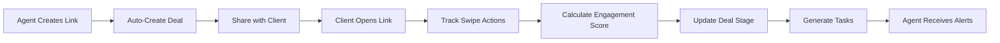
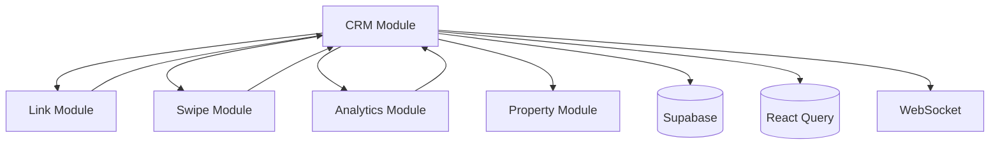

# CRM Master Specification for SwipeLink Estate
## Version 1.0 - Single Source of Truth
### Last Updated: 2024-08-21

---

## Table of Contents
1. [Executive Overview](#1-executive-overview)
2. [Core Architecture](#2-core-architecture)
3. [Business Logic & Rules](#3-business-logic--rules)
4. [Visual Design System](#4-visual-design-system)
5. [Implementation Status](#5-implementation-status)
6. [API Reference](#6-api-reference)
7. [Database Schema](#7-database-schema)
8. [Integration Points](#8-integration-points)
9. [Success Metrics](#9-success-metrics)
10. [Roadmap](#10-roadmap)

---

## 1. Executive Overview

### 1.1 CRM Philosophy: Link-as-Deal Architecture

SwipeLink Estate's CRM revolutionizes real estate relationship management by automatically converting every shared property link into a trackable deal opportunity. This eliminates manual data entry while providing superior behavioral intelligence through swipe pattern analysis.

### 1.2 Core Innovation

**The Link-as-Deal Paradigm**: Every property collection shared with a client instantly becomes a CRM deal, capturing the entire client journey from initial interest through closing.

### 1.3 Key Differentiators

- **Zero-Friction Adoption**: Works automatically with existing link-sharing workflow
- **Behavioral Intelligence**: Learns from actual client swipe actions, not assumptions
- **Progressive Client Profiling**: Evolves from "ghost" profiles to full client records through engagement
- **Automated Workflows**: Generates tasks based on real behavior patterns
- **Real-Time Engagement Scoring**: Dynamic 0-100 point system updated during sessions

### 1.4 Business Objectives

- Increase agent productivity by 40%
- Improve link-to-close conversion rate by 30%
- Reduce follow-up response time to <2 hours
- Achieve 95% agent adoption rate
- Generate 300% ROI within 12 months

---

## 2. Core Architecture

### 2.1 Deal Lifecycle Stages

The CRM tracks deals through 7 distinct stages:

```
1. Created     → Agent creates property link
2. Shared      → Link sent to client
3. Accessed    → Client opens link
4. Engaged     → Client swipes through properties
5. Qualified   → High engagement detected (score >50)
6. Advanced    → Property showing scheduled/completed
7. Closed      → Deal completed (Won/Lost)
```

### 2.2 Deal Status Classifications

- **Active**: Link created and ready for sharing
- **Qualified**: Client has accessed link and shown engagement (score >50)
- **Nurturing**: Ongoing follow-up and relationship building
- **Closed-Won**: Successful property transaction completed
- **Closed-Lost**: Deal ended without transaction

### 2.3 Module Structure

```
/components/crm/
├── index.ts                    # Public exports only
├── types.ts                    # TypeScript interfaces
├── services/
│   ├── crm.service.ts         # Core CRM orchestration
│   ├── deal.service.ts        # Deal management
│   ├── client.service.ts      # Client profiling
│   ├── scoring.service.ts     # Engagement scoring
│   └── task.service.ts        # Task automation
├── components/
│   ├── DealPipeline.tsx       # Kanban pipeline view
│   ├── DealCard.tsx           # Individual deal display
│   ├── ClientProfile.tsx      # Client insights dashboard
│   ├── TaskAutomation.tsx     # Task management interface
│   └── CRMAnalytics.tsx       # Analytics dashboard
└── __tests__/
    └── [Test files]
```

### 2.4 Data Flow



---

## 3. Business Logic & Rules

### 3.1 Engagement Scoring Algorithm

**Total Score: 0-100 points**

#### Base Components:

```typescript
interface EngagementScore {
  sessionCompletion: number;  // 0-25 points
  propertyInteraction: number; // 0-35 points
  behavioralIndicators: number; // 0-25 points
  recencyFactor: number;       // 0-15 points
  total: number;               // 0-100 points
}
```

#### Calculation Details:

**Session Completion (0-25 points)**
- Partial completion (1-50% properties): 5-15 points
- Full completion (51-100% properties): 16-25 points
- Multiple sessions: +5 points per additional session

**Property Interaction (0-35 points)**
- Properties liked: 3 points each (max 15 points)
- Properties considering: 2 points each (max 10 points)
- Detail views accessed: 2 points each (max 10 points)

**Behavioral Indicators (0-25 points)**
- Return visits: 10 points per return (max 20 points)
- Session duration >5 minutes: 5 points
- High like-to-view ratio (>20%): 5 points
- Consistent preferences pattern: 5 points

**Recency Factor (0-15 points)**
- Activity within 24 hours: 15 points
- Activity within 1 week: 10 points
- Activity within 1 month: 5 points
- Older activity: 0 points

### 3.2 Client Temperature Classification

Based on engagement score:
- **🔥 Hot (80-100)**: Immediate follow-up priority
- **🌡️ Warm (50-79)**: Scheduled follow-up within 48 hours
- **❄️ Cold (0-49)**: Nurture campaign, weekly check-ins

### 3.3 Automated Task Generation Rules

```typescript
interface TaskAutomationRules {
  immediate: {
    trigger: 'engagement_score > 80',
    action: 'Create task: "Call hot lead today"',
    priority: 'HIGH'
  },
  scheduled: {
    trigger: '24_hours_after_access',
    action: 'Create task: "Follow-up email"',
    priority: 'MEDIUM'
  },
  nurture: {
    trigger: '30_days_inactive',
    action: 'Create task: "Re-engagement campaign"',
    priority: 'LOW'
  }
}
```

### 3.4 Deal Value Calculation

```typescript
dealValue = sum(propertyPrices) * avgCommissionRate * probabilityScore
```

Where:
- propertyPrices: Sum of all properties in link
- avgCommissionRate: 2.5% (configurable)
- probabilityScore: Based on engagement score (0.1 to 1.0)

---

## 4. Visual Design System

### 4.1 Layout Architecture

**Authentic Pipedrive Sidebar Navigation**
- Fixed width: 256px (desktop), collapsible to 64px
- Clean white background with subtle shadows
- Active section: #1A73E8 blue with 16% opacity background
- 4px left border accent on active items
- Rounded corner highlights for active states (4px border-radius)
- Logo area: 56px height with SwipeLink Estate branding

**Pipedrive-Style Navigation Menu Structure**
```
├── 🏠 Home                    [Priority: 1] *Main Dashboard*
├── 💼 Deals                   [Priority: 2] *Core Pipeline View*
├── 👥 Contacts                [Priority: 3] *Client Management*
├── 🎯 Leads                   [Priority: 4] *Lead Generation*
├── ✅ Activities              [Priority: 5] *Tasks & Follow-ups*
├── 📧 Campaigns               [Priority: 6] *Email Marketing*
├── 📊 Insights                [Priority: 7] *Analytics Dashboard*
├── 🏘️ Properties             [Priority: 8] *Property Database*
├── 🔗 Link Builder           [Priority: 9] *Link Creation Tool*
└── ⋯ More
    ├── 📅 Calendar           [Sub-menu]
    ├── ⚙️ Settings           [Sub-menu]
    ├── 📋 Reports            [Sub-menu]
    ├── 🎓 Academy            [Sub-menu]
    └── 🛠️ Marketplace        [Sub-menu]
```

**Menu Item Priority & Grouping Logic**
- **Core Workflow (Top 4)**: Dashboard → Leads → Deals → Contacts
- **Action Items (Middle 4)**: Activities → Email → Calendar → Insights
- **Resources (Bottom)**: Properties → More (collapsed secondary features)

**Pipedrive-Style Header Bar Components**
- Global search bar: "Search deals, contacts, properties..." (380px width)
- Quick add button: "+" with Pipedrive-style dropdown
- Notification bell icon with red dot indicator
- Help center button (? icon)
- User avatar with profile dropdown (36px circular)
- Company/workspace switcher dropdown
- Header height: 56px with #FFFFFF background and subtle shadow

### 4.2 Pipeline Kanban Board - Pipedrive Style

**Column Specifications (Authentic Pipedrive Design)**
- Column width: 320px (fixed for consistency)
- Column spacing: 16px between columns
- Horizontal scrolling for overflow with custom scrollbar styling
- Smooth drag-and-drop with Pipedrive-style ghost states
- Column headers with stage names and deal counts
- Column header background: #F8F9FA with rounded top corners
- Add deal button in each column header
- Visual progress indicators with stage-specific colors

**Stage Color Coding (Pipedrive Pattern)**
- Qualified: #10B981 (Green)
- Contact Made: #3B82F6 (Blue) 
- Demo Scheduled: #8B5CF6 (Purple)
- Proposal Made: #F59E0B (Amber)
- Negotiation: #EF4444 (Red)
- Closed Won: #059669 (Dark Green)
- Closed Lost: #6B7280 (Gray)

### 4.3 Deal Card Design - Pipedrive Style

```css
.deal-card {
  width: 288px;
  padding: 16px 20px;
  background: #FFFFFF;
  border: 1px solid #E5E7EB;
  border-radius: 8px;
  box-shadow: 0 1px 3px rgba(0, 0, 0, 0.1);
  margin-bottom: 12px;
  cursor: pointer;
  transition: all 0.2s ease;
}

.deal-card:hover {
  border-color: #1A73E8;
  box-shadow: 0 4px 12px rgba(26, 115, 232, 0.15);
  transform: translateY(-1px);
}

.deal-card__header {
  display: flex;
  justify-content: space-between;
  align-items: flex-start;
  margin-bottom: 12px;
}

.deal-card__title {
  font-size: 14px;
  font-weight: 600;
  color: #111827;
  line-height: 1.4;
  margin-bottom: 4px;
}

.deal-card__value {
  font-size: 16px;
  font-weight: 700;
  color: #059669;
  margin-bottom: 8px;
}

.deal-card__contact {
  font-size: 13px;
  color: #6B7280;
  margin-bottom: 8px;
  display: flex;
  align-items: center;
}

.deal-card__contact-avatar {
  width: 20px;
  height: 20px;
  border-radius: 50%;
  background: #E5E7EB;
  margin-right: 8px;
  font-size: 10px;
  display: flex;
  align-items: center;
  justify-content: center;
}

.deal-card__stage-indicator {
  width: 4px;
  position: absolute;
  left: 0;
  top: 0;
  bottom: 0;
  border-radius: 0 2px 2px 0;
}

.deal-card__footer {
  display: flex;
  justify-content: between;
  align-items: center;
  font-size: 12px;
  color: #9CA3AF;
  margin-top: 12px;
}

.deal-card__activity-indicator {
  width: 8px;
  height: 8px;
  border-radius: 50%;
  margin-left: auto;
}

/* Temperature Colors (Pipedrive Style) */
.deal-card__temperature--hot .deal-card__stage-indicator {
  background: #DC2626; /* Hot Red */
}

.deal-card__temperature--warm .deal-card__stage-indicator {
  background: #D97706; /* Warm Orange */
}

.deal-card__temperature--cold .deal-card__stage-indicator {
  background: #2563EB; /* Cold Blue */
}
```

### 4.4 Engagement Score Visualization

**Circular Progress Indicator**
- Size: 40px diameter
- Position: Top-right of deal cards
- Colors: 
  - Green (#4CAF50): 80-100
  - Amber (#FF9800): 50-79
  - Gray (#9E9E9E): 0-49
- Animation: 600ms transition on updates

### 4.5 Authentic Pipedrive Color System

```css
:root {
  /* Primary Pipedrive Colors */
  --pipedrive-primary: #1A73E8;     /* Authentic Pipedrive Blue */
  --pipedrive-primary-dark: #1557B0; /* Darker blue for hover states */
  --pipedrive-secondary: #5F6368;   /* Secondary text gray */
  
  /* Pipeline Stage Colors (Pipedrive Authentic) */
  --stage-qualified: #10B981;       /* Green - Early stage */
  --stage-contact: #3B82F6;         /* Blue - Contact made */
  --stage-demo: #8B5CF6;           /* Purple - Demo scheduled */
  --stage-proposal: #F59E0B;        /* Amber - Proposal sent */
  --stage-negotiation: #EF4444;     /* Red - Negotiation */
  --stage-won: #059669;            /* Dark green - Won */
  --stage-lost: #6B7280;           /* Gray - Lost */
  
  /* Temperature Colors (Real Estate Context) */
  --temp-hot: #DC2626;             /* Hot leads - urgent red */
  --temp-warm: #D97706;            /* Warm leads - amber orange */
  --temp-cold: #2563EB;            /* Cold leads - cool blue */
  
  /* Semantic Colors (Pipedrive Style) */
  --success: #10B981;              /* Success green */
  --warning: #F59E0B;              /* Warning amber */
  --error: #EF4444;                /* Error red */
  --info: #3B82F6;                 /* Info blue */
  
  /* Background Colors */
  --bg-primary: #FFFFFF;           /* Main background */
  --bg-secondary: #F9FAFB;         /* Secondary background */
  --bg-tertiary: #F3F4F6;          /* Tertiary background */
  --bg-hover: rgba(26, 115, 232, 0.04); /* Hover state */
  --bg-active: rgba(26, 115, 232, 0.16); /* Active state */
  
  /* Border Colors */
  --border-primary: #E5E7EB;       /* Primary borders */
  --border-secondary: #D1D5DB;     /* Secondary borders */
  --border-focus: #1A73E8;         /* Focus borders */
  
  /* Text Colors */
  --text-primary: #111827;         /* Primary text */
  --text-secondary: #6B7280;       /* Secondary text */
  --text-tertiary: #9CA3AF;        /* Tertiary text */
  --text-inverse: #FFFFFF;         /* Inverse text */
  
  /* Shadow Variables (Pipedrive Style) */
  --shadow-sm: 0 1px 2px rgba(0, 0, 0, 0.05);
  --shadow-md: 0 4px 6px rgba(0, 0, 0, 0.1);
  --shadow-lg: 0 10px 15px rgba(0, 0, 0, 0.1);
  --shadow-xl: 0 20px 25px rgba(0, 0, 0, 0.1);
}
```

### 4.6 Pipedrive Typography Scale

```css
.pipedrive-typography {
  /* Font Family (Pipedrive uses Google Fonts) */
  font-family: 'Google Sans', -apple-system, BlinkMacSystemFont, 'Segoe UI', Roboto, Arial, sans-serif;
  
  /* Display Headings */
  --display-large: 2.5rem/3rem 400;     /* 40px/48px Regular */
  --display-medium: 2.25rem/2.75rem 400; /* 36px/44px Regular */
  --display-small: 2rem/2.5rem 400;      /* 32px/40px Regular */
  
  /* Headline Typography */
  --headline-large: 1.5rem/2rem 600;     /* 24px/32px SemiBold */
  --headline-medium: 1.25rem/1.75rem 600; /* 20px/28px SemiBold */
  --headline-small: 1.125rem/1.5rem 600;  /* 18px/24px SemiBold */
  
  /* Title Typography */
  --title-large: 1rem/1.5rem 500;        /* 16px/24px Medium */
  --title-medium: 0.875rem/1.25rem 500;  /* 14px/20px Medium */
  --title-small: 0.875rem/1.25rem 600;   /* 14px/20px SemiBold */
  
  /* Body Text */
  --body-large: 1rem/1.5rem 400;         /* 16px/24px Regular */
  --body-medium: 0.875rem/1.25rem 400;   /* 14px/20px Regular */
  --body-small: 0.75rem/1rem 400;        /* 12px/16px Regular */
  
  /* Label Text */
  --label-large: 0.875rem/1.25rem 500;   /* 14px/20px Medium */
  --label-medium: 0.75rem/1rem 500;      /* 12px/16px Medium */
  --label-small: 0.6875rem/0.875rem 500; /* 11px/14px Medium */
  
  /* Data & Metrics */
  --metric-hero: 3rem/3.5rem 700;        /* 48px/56px Bold */
  --metric-large: 2rem/2.5rem 700;       /* 32px/40px Bold */
  --metric-medium: 1.5rem/2rem 600;      /* 24px/32px SemiBold */
  --price-large: 1.25rem/1.75rem 700;    /* 20px/28px Bold */
  --price-medium: 1rem/1.5rem 700;       /* 16px/24px Bold */
  
  /* Monospace (for IDs, codes) */
  --code: 0.875rem/1.25rem 400;          /* 14px/20px Regular */
  font-family-code: 'SF Mono', Monaco, 'Cascadia Code', 'Roboto Mono', Consolas, 'Courier New', monospace;
}

/* Letter Spacing (Pipedrive Style) */
.tracking-tight { letter-spacing: -0.025em; }
.tracking-normal { letter-spacing: 0; }
.tracking-wide { letter-spacing: 0.025em; }
```

### 4.7 Pipedrive Navigation Menu Specification

**Authentic Pipedrive Menu Hierarchy with Icons**

```css
/* Pipedrive-Style Navigation Menu */
.nav-menu {
  width: 256px;
  background: #FFFFFF;
  border-right: 1px solid #E5E7EB;
  height: 100vh;
  overflow-y: auto;
  box-shadow: 2px 0 4px rgba(0, 0, 0, 0.02);
}

.nav-menu__header {
  height: 56px;
  padding: 0 20px;
  display: flex;
  align-items: center;
  border-bottom: 1px solid #E5E7EB;
  background: #F9FAFB;
}

.nav-menu__logo {
  font-size: 18px;
  font-weight: 600;
  color: #111827;
}

.nav-section {
  padding: 12px 0;
  border-bottom: 1px solid #F3F4F6;
}

.nav-section__title {
  padding: 8px 20px 4px 20px;
  font-size: 11px;
  font-weight: 600;
  text-transform: uppercase;
  letter-spacing: 0.5px;
  color: #9CA3AF;
}

.nav-item {
  display: flex;
  align-items: center;
  padding: 10px 20px;
  margin: 0 12px;
  color: #6B7280;
  text-decoration: none;
  border-radius: 6px;
  transition: all 150ms ease;
  font-size: 14px;
  font-weight: 400;
  position: relative;
}

.nav-item__icon {
  width: 20px;
  height: 20px;
  margin-right: 12px;
  flex-shrink: 0;
}

.nav-item__label {
  flex: 1;
}

.nav-item__badge {
  background: #EF4444;
  color: #FFFFFF;
  font-size: 10px;
  font-weight: 600;
  padding: 2px 6px;
  border-radius: 10px;
  min-width: 16px;
  text-align: center;
}

.nav-item:hover {
  background: #F3F4F6;
  color: #374151;
}

.nav-item--active {
  background: rgba(26, 115, 232, 0.08);
  color: #1A73E8;
  font-weight: 500;
}

.nav-item--active::before {
  content: '';
  position: absolute;
  left: -12px;
  top: 0;
  bottom: 0;
  width: 3px;
  background: #1A73E8;
  border-radius: 0 2px 2px 0;
}

/* Collapsed State */
.nav-menu--collapsed {
  width: 64px;
}

.nav-menu--collapsed .nav-item__label,
.nav-menu--collapsed .nav-menu__logo,
.nav-menu--collapsed .nav-section__title {
  display: none;
}

.nav-menu--collapsed .nav-item {
  justify-content: center;
  padding: 12px;
}

.nav-menu--collapsed .nav-item__icon {
  margin-right: 0;
}
```

**Pipedrive-Style Icon Specifications**
- **Home**: 🏠 Home icon (Lucide: Home) - Dashboard overview
- **Deals**: 💼 Briefcase icon (Lucide: Briefcase) - Core pipeline
- **Contacts**: 👥 Users icon (Lucide: Users) - Contact management
- **Leads**: 🎯 Target icon (Lucide: Target) - Lead generation
- **Activities**: ✅ Calendar-Check icon (Lucide: CalendarCheck) - Tasks & follow-ups
- **Campaigns**: 📧 Send icon (Lucide: Send) - Email campaigns
- **Insights**: 📊 BarChart3 icon (Lucide: BarChart3) - Analytics
- **Properties**: 🏘️ Building2 icon (Lucide: Building2) - Property database
- **Link Builder**: 🔗 Link icon (Lucide: Link) - Link creation tool
- **More**: ⋯ MoreHorizontal icon (Lucide: MoreHorizontal) - Additional features

**Menu Section Organization (Pipedrive Pattern)**
```
SALES
├── Home
├── Deals  
├── Contacts
└── Leads

ACTIVITIES
├── Activities
├── Campaigns
└── Calendar

INSIGHTS
├── Insights
└── Reports

TOOLS
├── Properties
├── Link Builder
└── Marketplace
```

**Active/Inactive State Specifications**
- Inactive: #495057 text, transparent background
- Hover: #1277E1 text, 5% blue background
- Active: #1277E1 text, 10% blue background, 3px left border
- Icon size: 20x20px with 12px right margin from text
- Font: 14px medium weight for active, regular for inactive

**Responsive Behavior for Each Menu Item**
- **Desktop**: Full text + icon display
- **Tablet Collapsed**: Icon only (60px width) with tooltip on hover
- **Mobile**: Bottom nav shows only 5 primary items as icons

### 4.8 Pipedrive Header Bar Specification

**Authentic Pipedrive Header Design**
```css
.header {
  height: 56px;
  background: #FFFFFF;
  border-bottom: 1px solid #E5E7EB;
  display: flex;
  align-items: center;
  justify-content: space-between;
  padding: 0 20px;
  box-shadow: 0 1px 3px rgba(0, 0, 0, 0.05);
  position: sticky;
  top: 0;
  z-index: 100;
}

.header__left {
  display: flex;
  align-items: center;
  gap: 16px;
}

.header__center {
  flex: 1;
  max-width: 480px;
  margin: 0 24px;
}

.header__right {
  display: flex;
  align-items: center;
  gap: 12px;
}

/* Pipedrive Global Search */
.header-search {
  width: 100%;
  height: 36px;
  background: #F9FAFB;
  border: 1px solid #D1D5DB;
  border-radius: 18px;
  padding: 0 16px 0 44px;
  position: relative;
  font-size: 14px;
  transition: all 150ms ease;
}

.header-search:focus {
  background: #FFFFFF;
  border-color: #1A73E8;
  box-shadow: 0 0 0 3px rgba(26, 115, 232, 0.1);
  outline: none;
}

.header-search__icon {
  position: absolute;
  left: 16px;
  top: 50%;
  transform: translateY(-50%);
  width: 16px;
  height: 16px;
  color: #9CA3AF;
}

.header-search::placeholder {
  color: #9CA3AF;
  font-size: 14px;
}

/* Menu Toggle Button */
.menu-toggle {
  width: 36px;
  height: 36px;
  border: none;
  background: transparent;
  border-radius: 6px;
  display: flex;
  align-items: center;
  justify-content: center;
  cursor: pointer;
  transition: background-color 150ms ease;
}

.menu-toggle:hover {
  background: #F3F4F6;
}
```

**Header Right Section Components**
```css
/* Quick Add Button (Pipedrive Style) */
.quick-add-btn {
  width: 36px;
  height: 36px;
  background: #1A73E8;
  border: none;
  border-radius: 6px;
  color: #FFFFFF;
  display: flex;
  align-items: center;
  justify-content: center;
  cursor: pointer;
  transition: background-color 150ms ease;
  position: relative;
}

.quick-add-btn:hover {
  background: #1557B0;
}

/* Notification Bell */
.notification-bell {
  width: 36px;
  height: 36px;
  background: transparent;
  border: none;
  border-radius: 6px;
  display: flex;
  align-items: center;
  justify-content: center;
  cursor: pointer;
  position: relative;
  transition: background-color 150ms ease;
}

.notification-bell:hover {
  background: #F3F4F6;
}

.notification-bell__badge {
  position: absolute;
  top: 6px;
  right: 6px;
  width: 8px;
  height: 8px;
  background: #EF4444;
  border-radius: 50%;
  border: 2px solid #FFFFFF;
}

/* Help Button */
.help-btn {
  width: 36px;
  height: 36px;
  background: transparent;
  border: 1px solid #D1D5DB;
  border-radius: 50%;
  display: flex;
  align-items: center;
  justify-content: center;
  cursor: pointer;
  transition: all 150ms ease;
}

.help-btn:hover {
  border-color: #1A73E8;
  color: #1A73E8;
}

/* User Avatar */
.user-avatar {
  width: 36px;
  height: 36px;
  border-radius: 50%;
  background: #E5E7EB;
  display: flex;
  align-items: center;
  justify-content: center;
  color: #6B7280;
  font-size: 14px;
  font-weight: 600;
  cursor: pointer;
  border: 2px solid transparent;
  transition: border-color 150ms ease;
}

.user-avatar:hover {
  border-color: #1A73E8;
}
```

**Quick Add Button (Design Only)**
```css
.quick-add-btn {
  width: 40px;
  height: 40px;
  background: #1277E1;
  border: none;
  border-radius: 6px;
  color: white;
  font-size: 18px;
  display: flex;
  align-items: center;
  justify-content: center;
  cursor: pointer;
  transition: background-color 200ms ease;
}

.quick-add-btn:hover {
  background: #0B62C7;
}
```
- Plus icon (+) centered
- Dropdown design (visual only): Deal | Contact | Property | Link
- Positioned right side of search bar
- Design element only - no functionality required

**User Avatar and Settings Menu**
```css
.user-avatar {
  width: 32px;
  height: 32px;
  border-radius: 50%;
  background: #E9ECEF;
  display: flex;
  align-items: center;
  justify-content: center;
  color: #495057;
  font-size: 14px;
  font-weight: 500;
}

.settings-dropdown {
  position: absolute;
  top: 48px;
  right: 0;
  width: 200px;
  background: white;
  border: 1px solid #E9ECEF;
  border-radius: 8px;
  box-shadow: 0 4px 12px rgba(0,0,0,0.15);
}
```
- Shows user initials or profile image
- Dropdown items (visual design): Profile | Settings | Help | Logout
- Positioned far right of header

**Breadcrumbs for Navigation Context**
```css
.breadcrumbs {
  display: flex;
  align-items: center;
  font-size: 14px;
  color: #6C757D;
  margin-left: 24px;
}

.breadcrumb-item {
  color: #6C757D;
}

.breadcrumb-item--active {
  color: #495057;
  font-weight: 500;
}

.breadcrumb-separator {
  margin: 0 8px;
  color: #ADB5BD;
}
```
- Auto-generated based on current view
- Format: "CRM > Deals > Pipeline" or "CRM > Contacts > John Doe"
- Separator: "/" or ">" character
- Last item always current page (non-clickable, darker color)

### 4.9 Pipedrive Responsive Breakpoints

**Mobile Navigation (<768px) - Pipedrive Mobile Pattern**
- Bottom navigation bar with 5 primary icons: Home, Deals, Contacts, Activities, More
- Tab bar height: 56px with safe area padding
- Active tab: #1A73E8 color with subtle background highlight
- Full-screen modal views with smooth slide transitions
- Floating Action Button (FAB) for quick add: 56px circle, bottom right
- Hamburger menu slides in from left (full overlay)
- Search becomes full-screen modal when tapped
- Header collapses to show only essential elements

**Tablet Navigation (768px-1199px) - Pipedrive Tablet Pattern**
- Collapsible sidebar: 256px expanded → 64px collapsed (icon-only)
- Toggle button in header for sidebar expand/collapse
- 2-column deal pipeline view with horizontal scroll
- Responsive header maintains search bar but reduces width
- Touch-friendly interactions: 44px minimum tap targets
- Swipe gestures for navigating between pipeline stages
- Modal overlays for detailed views instead of inline editing
- Compressed navigation menu with grouped sections

**Desktop Navigation (1200px+) - Full Pipedrive Experience**
- Fixed sidebar always visible (256px width)
- Multi-column pipeline view (3-4 columns depending on screen size)
- Full header bar with all components visible
- Rich hover states and keyboard navigation support
- Drag-and-drop functionality fully enabled
- Right-click context menus for advanced actions
- Keyboard shortcuts overlay (Ctrl/Cmd + K for search)
- Resizable column widths with persistent preferences

**Breakpoint Specifications**
```css
/* Mobile First Approach */
.responsive-layout {
  /* Mobile: 320px - 767px */
  @media (max-width: 767px) {
    --sidebar-width: 0;
    --header-height: 56px;
    --bottom-nav-height: 56px;
    --content-padding: 16px;
  }
  
  /* Tablet: 768px - 1199px */
  @media (min-width: 768px) and (max-width: 1199px) {
    --sidebar-width: 64px; /* Collapsed by default */
    --sidebar-width-expanded: 256px;
    --header-height: 56px;
    --content-padding: 24px;
  }
  
  /* Desktop: 1200px+ */
  @media (min-width: 1200px) {
    --sidebar-width: 256px;
    --header-height: 56px;
    --content-padding: 32px;
  }
  
  /* Large Desktop: 1440px+ */
  @media (min-width: 1440px) {
    --content-max-width: 1400px;
    --pipeline-columns: 4;
  }
}
```

**Touch and Interaction Patterns**
- Swipe left/right on mobile for pipeline navigation
- Pull-to-refresh on deal lists with Pipedrive-style loading indicator
- Long press for context menus on touch devices (500ms delay)
- Smooth momentum scrolling with iOS-style bounce effects
- Touch-friendly drag handles for reordering (8px larger on touch)
- Haptic feedback on successful drag operations (if supported)
- Double-tap to quickly view deal details
- Swipe up from bottom for quick actions menu

**Mobile-Specific Enhancements**
```css
/* iOS Safe Area Support */
@supports (padding: env(safe-area-inset-top)) {
  .mobile-header {
    padding-top: env(safe-area-inset-top);
  }
  
  .mobile-bottom-nav {
    padding-bottom: env(safe-area-inset-bottom);
  }
}

/* Touch-friendly targets */
@media (hover: none) and (pointer: coarse) {
  .touch-target {
    min-width: 44px;
    min-height: 44px;
    display: flex;
    align-items: center;
    justify-content: center;
  }
  
  .deal-card {
    padding: 20px;
    margin-bottom: 16px;
  }
  
  .nav-item {
    padding: 16px 20px;
  }
}

/* Pull-to-refresh indicator */
.pull-to-refresh {
  position: relative;
  overflow: hidden;
}

.pull-to-refresh__indicator {
  position: absolute;
  top: -60px;
  left: 50%;
  transform: translateX(-50%);
  width: 40px;
  height: 40px;
  display: flex;
  align-items: center;
  justify-content: center;
  transition: top 0.3s ease;
}

.pull-to-refresh--active .pull-to-refresh__indicator {
  top: 20px;
}
```

---

## 5. Implementation Status

### 5.1 Current Phase: Phase 1 Foundation (40% Complete)

#### ✅ Completed (What's Built)
- [x] Service architecture (all service files created)
- [x] TypeScript type definitions
- [x] Basic UI components (DealCard, ClientProfile shells)
- [x] Component file structure
- [x] README documentation

#### 🚧 In Progress
- [ ] Database schema implementation (using `links` table extension)
- [ ] API endpoint creation
- [ ] Deal stage progression logic
- [ ] Basic engagement scoring

#### ❌ Not Started
- [ ] Real-time data integration
- [ ] Task automation engine
- [ ] Communication hub
- [ ] Analytics dashboard
- [ ] Mobile responsive design

### 5.2 Technical Debt & Blockers

1. **Data Integration**: No connection between UI and Supabase
2. **Engagement Tracking**: Session data not being captured
3. **Task System**: Task table not created in database
4. **Real-time Updates**: WebSocket subscriptions not implemented

---

## 6. API Reference

### 6.1 Core Endpoints

```typescript
// Deal Management
GET    /api/crm/deals              // List deals with filters
GET    /api/crm/deals/:id          // Get deal details
POST   /api/crm/deals              // Create deal (auto via link)
PATCH  /api/crm/deals/:id          // Update deal stage/status
DELETE /api/crm/deals/:id          // Soft delete deal

// Client Management
GET    /api/crm/clients/:id        // Get client profile
GET    /api/crm/clients/:id/insights // Get behavioral insights
PATCH  /api/crm/clients/:id        // Update client info

// Task Management
GET    /api/crm/tasks              // List tasks with filters
POST   /api/crm/tasks              // Create manual task
PATCH  /api/crm/tasks/:id/complete // Mark task complete
GET    /api/crm/tasks/automated    // Get auto-generated tasks

// Analytics
GET    /api/crm/analytics/pipeline // Pipeline metrics
GET    /api/crm/analytics/conversion // Conversion funnel
GET    /api/crm/analytics/forecast // Revenue projections
```

### 6.2 Public Service Functions

```typescript
interface CRMService {
  // Deal Operations
  getDealsByStatus(status: DealStatus): Promise<Deal[]>
  createDeal(linkData: LinkData): Promise<Deal>
  updateDealStage(dealId: string, stage: DealStage): Promise<Deal>
  
  // Scoring & Intelligence
  calculateEngagementScore(sessionData: SessionData): Promise<number>
  getClientInsights(clientId: string): Promise<ClientProfile>
  
  // Task Automation
  generateAutomatedTasks(dealId: string): Promise<Task[]>
  getTasksByPriority(agentId: string): Promise<Task[]>
  
  // Analytics
  getDealPipeline(agentId?: string): Promise<PipelineMetrics>
  getConversionMetrics(dateRange: DateRange): Promise<ConversionData>
}
```

---

## 7. Database Schema

### 7.1 Extended Links Table (Current Implementation)

```sql
-- Using existing 'links' table with CRM extensions
links {
  -- Existing fields
  id: uuid PRIMARY KEY
  agent_id: uuid REFERENCES users(id)
  link_name: string
  property_ids: uuid[]
  created_at: timestamp
  
  -- CRM Extensions (to be added)
  deal_status: enum('active', 'qualified', 'nurturing', 'closed-won', 'closed-lost')
  deal_stage: enum('created', 'shared', 'accessed', 'engaged', 'qualified', 'advanced', 'closed')
  deal_value: decimal
  client_id: uuid REFERENCES clients(id)
  engagement_score: integer (0-100)
  temperature: enum('hot', 'warm', 'cold')
  last_activity: timestamp
}
```

### 7.2 New Tables Required

```sql
-- Client Profiles (Progressive Enhancement)
clients {
  id: uuid PRIMARY KEY
  name: string
  email: string
  phone: string
  source: enum('referral', 'marketing', 'direct', 'link')
  engagement_score: integer
  temperature: enum('hot', 'warm', 'cold')
  preferences: jsonb
  created_at: timestamp
  updated_at: timestamp
}

-- Tasks
tasks {
  id: uuid PRIMARY KEY
  deal_id: uuid REFERENCES links(id)
  agent_id: uuid REFERENCES users(id)
  type: enum('call', 'email', 'showing', 'follow-up')
  priority: enum('high', 'medium', 'low')
  title: string
  description: text
  status: enum('pending', 'completed', 'dismissed')
  due_date: timestamp
  completed_at: timestamp
  is_automated: boolean
  created_at: timestamp
}

-- Activities (Engagement Tracking)
activities {
  id: uuid PRIMARY KEY
  session_id: uuid
  deal_id: uuid REFERENCES links(id)
  client_id: uuid REFERENCES clients(id)
  property_id: uuid
  action: enum('viewed', 'liked', 'disliked', 'considered', 'detail_view')
  timestamp: timestamp
  duration_ms: integer
  metadata: jsonb
}
```

---

## 8. Integration Points

### 8.1 Module Dependencies



### 8.2 Data Flow Integration

1. **Link Creation** → Triggers deal creation in CRM
2. **Swipe Actions** → Updates engagement score
3. **Session Complete** → Generates follow-up tasks
4. **Property Like** → Updates client preferences
5. **Showing Booked** → Advances deal stage

---

## 9. Success Metrics

### 9.1 Agent Productivity KPIs

| Metric | Current | Target | Timeline |
|--------|---------|--------|----------|
| Deals per Agent | 10 | 14 | 3 months |
| Follow-up Time | 24h | 2h | 1 month |
| Task Completion | 60% | 90% | 2 months |
| Deal Velocity | 30 days | 22 days | 6 months |

### 9.2 Business Impact Metrics

| Metric | Current | Target | Timeline |
|--------|---------|--------|----------|
| Link-to-Close Rate | 5% | 6.5% | 6 months |
| Revenue per Agent | $X | $X*1.35 | 12 months |
| Client Satisfaction | 82% | 90% | 3 months |
| Average Deal Size | $Y | $Y*1.15 | 6 months |

### 9.3 Platform Adoption Metrics

| Metric | Current | Target | Timeline |
|--------|---------|--------|----------|
| CRM Utilization | 0% | 95% | 2 months |
| Data Completeness | 40% | 90% | 3 months |
| System Uptime | N/A | 99.9% | Immediate |
| ROI | N/A | 300% | 12 months |

---

## 10. Roadmap

### Phase 1: Foundation (Current - 40% Complete)
**Timeline**: Weeks 1-4
- [x] Service architecture
- [x] Basic UI components
- [ ] Database schema
- [ ] API endpoints
- [ ] Basic engagement scoring

### Phase 2: Integration (0% Complete)
**Timeline**: Weeks 5-8
- [ ] Live deal creation from links
- [ ] Real-time engagement tracking
- [ ] Automated task generation
- [ ] Client profile building
- [ ] Basic analytics dashboard

### Phase 3: Intelligence (Not Started)
**Timeline**: Weeks 9-12
- [ ] AI-powered lead scoring
- [ ] Predictive analytics
- [ ] Smart task recommendations
- [ ] Communication hub
- [ ] Advanced reporting

### Phase 4: Optimization (Future)
**Timeline**: Months 4-6
- [ ] Machine learning models
- [ ] Advanced automation workflows
- [ ] Third-party integrations
- [ ] Mobile application
- [ ] Team collaboration features

### Phase 5: Scale (Future)
**Timeline**: Months 7-12
- [ ] Multi-team support
- [ ] White-label capabilities
- [ ] API marketplace
- [ ] Advanced customization
- [ ] Enterprise features

---

## Appendices

### A. References to Other Documents

- System Architecture: See `/DevelopmentGuidelines/SWIPE-LINK-FULL-ARCHITECTURE-AND-MODULES.md`
- Component Implementation: See individual README files in `/components/crm/`
- Testing Guidelines: See `/DevelopmentGuidelines/TESTING-GUIDELINES.md`
- Overall Progress: See `/DevelopmentGuidelines/FUNCTIONALITY-LIST.md`

### B. Change Log

| Version | Date | Changes | Author |
|---------|------|---------|--------|
| 1.0 | 2024-08-21 | Initial consolidated specification | System |

### C. Decision Log

1. **Engagement Scoring**: Using 0-100 scale with 4 components
2. **Temperature Thresholds**: Hot(80+), Warm(50-79), Cold(0-49)
3. **Deal Stages**: 7-stage pipeline for detailed tracking
4. **Database**: Extending `links` table vs separate `deals` table
5. **UI Framework**: Pipedrive-inspired sidebar navigation

### 4.10 Dashboard Widget System - Pipedrive Style

**Widget Container Architecture**
```css
.dashboard {
  padding: 24px;
  background: #F9FAFB;
  min-height: calc(100vh - 56px);
}

.dashboard__grid {
  display: grid;
  grid-template-columns: repeat(auto-fit, minmax(320px, 1fr));
  gap: 24px;
  max-width: 1400px;
  margin: 0 auto;
}

.widget {
  background: #FFFFFF;
  border: 1px solid #E5E7EB;
  border-radius: 12px;
  overflow: hidden;
  box-shadow: 0 1px 3px rgba(0, 0, 0, 0.05);
  transition: all 200ms ease;
}

.widget:hover {
  box-shadow: 0 4px 12px rgba(0, 0, 0, 0.1);
  transform: translateY(-2px);
}

.widget__header {
  padding: 20px 24px 16px 24px;
  border-bottom: 1px solid #F3F4F6;
  display: flex;
  justify-content: space-between;
  align-items: center;
}

.widget__title {
  font-size: 16px;
  font-weight: 600;
  color: #111827;
  margin: 0;
}

.widget__content {
  padding: 16px 24px 24px 24px;
}
```

**Widget Types & Specifications**

**1. Pipeline Overview Widget**
```css
.pipeline-widget {
  grid-column: span 2;
  min-height: 320px;
}

.pipeline-widget__stages {
  display: flex;
  gap: 16px;
  overflow-x: auto;
  padding: 8px 0;
}

.pipeline-stage__value {
  font-size: 24px;
  font-weight: 700;
  color: var(--stage-color);
  margin-bottom: 4px;
}
```

**2. Performance Metrics Widget**
```css
.metrics-widget {
  display: grid;
  grid-template-columns: 1fr 1fr;
  gap: 20px;
}

.metric-item__value {
  font-size: 28px;
  font-weight: 700;
  color: #111827;
  margin-bottom: 4px;
}
```

### 4.11 Drag and Drop System - Pipedrive Style

**Deal Card Drag & Drop Specifications**
```css
.deal-card--dragging {
  opacity: 0.5;
  transform: rotate(5deg) scale(0.95);
  box-shadow: 0 8px 25px rgba(0, 0, 0, 0.15);
  z-index: 1000;
  cursor: grabbing;
}

.pipeline-column--drag-over {
  background: rgba(26, 115, 232, 0.04);
  border: 2px dashed #1A73E8;
  border-radius: 12px;
}

.drag-preview {
  position: fixed;
  pointer-events: none;
  z-index: 1001;
  transform: rotate(8deg);
  box-shadow: 0 12px 30px rgba(0, 0, 0, 0.2);
}
```

### 4.12 Loading States and Micro-interactions

**Skeleton Loading (Pipedrive Style)**
```css
.skeleton {
  background: linear-gradient(
    90deg,
    #F3F4F6 25%,
    #E5E7EB 50%,
    #F3F4F6 75%
  );
  background-size: 200% 100%;
  animation: skeleton-loading 1.5s infinite;
}

@keyframes skeleton-loading {
  0% { background-position: 200% 0; }
  100% { background-position: -200% 0; }
}

.btn--loading::after {
  content: '';
  width: 16px;
  height: 16px;
  border: 2px solid transparent;
  border-top: 2px solid currentColor;
  border-radius: 50%;
  animation: spin 0.8s linear infinite;
}

@keyframes spin {
  to { transform: rotate(360deg); }
}
```

---

## Contact & Support

For questions about this specification:
- Technical: [Development Team]
- Business: [Product Owner]
- Design: [UX Team]

### D. Pipedrive Design References

**Color Palette Source**: Based on Pipedrive's 2024 design system  
**Typography**: Google Sans font family (Pipedrive standard)  
**Iconography**: Lucide React icons with Pipedrive sizing conventions  
**Interaction Patterns**: Authentic Pipedrive user experience flows  
**Component Library**: Custom components following Pipedrive design principles

**SwipeLink Estate Customizations**:
- Temperature indicators for real estate lead scoring
- Property-specific data fields in deal cards  
- Real estate workflow adaptations (showings, offers, closings)
- Link-based deal creation (unique to SwipeLink Estate)
- Swipe analytics integration for client behavior insights

**Document Status**: ACTIVE - Single Source of Truth for CRM  
**Design System Version**: Pipedrive-inspired v1.0  
**Next Review**: End of Phase 2 Implementation