# SwipeLink Estate Testing Guidelines

*Complete testing infrastructure and best practices for AI coding agents and human developers*

## MANDATORY RULES - NEVER VIOLATE

1. **NEVER write code without a test first** - Test must exist and fail before implementation
2. **NEVER skip tests** - If a test is broken, fix it, don't skip it
3. **NEVER commit with failing tests** - All tests must pass before git commit
4. **NEVER write more code than needed to pass the test** - Minimal implementation only
5. **ALWAYS run tests after every change** - Even small changes can break things
6. **ALWAYS use shared test infrastructure** - Use the centralized utilities from `/test/` directory

## TDD Decision Tree with Shared Infrastructure

```
START: Need to implement a feature?
│
├─ Does test file exist for this module?
│  ├─ NO → Create test file using shared infrastructure
│  └─ YES → Continue
│
├─ Import shared utilities
│  ├─ Use setupTest() from test/utils/testSetup.js
│  ├─ Use mock factories from test/utils/mockData.js
│  └─ Use Supabase mocks from test/mocks/supabase.js
│
├─ Write FAILING test with shared patterns
│  ├─ Does test fail? 
│  │  ├─ NO → Test is wrong, fix it
│  │  └─ YES → Continue
│  └─ 
│
├─ Write MINIMAL code to pass
│  ├─ Does test pass?
│  │  ├─ NO → Fix implementation
│  │  └─ YES → Continue
│  └─
│
├─ Are all tests still passing?
│  ├─ NO → Fix what broke
│  └─ YES → Continue
│
├─ Can code be improved?
│  ├─ YES → Refactor (keep running tests)
│  └─ NO → Complete
│
└─ END: Commit changes
```

## 🏗️ Shared Test Infrastructure Overview

SwipeLink Estate uses a modern, centralized test infrastructure to eliminate redundancy and improve maintainability. All tests should use these shared utilities.

### Infrastructure Directory Structure

```
test/
├── utils/
│   ├── mockData.js          # Factory functions for test data
│   ├── testSetup.js         # Shared test setup and utilities
│   ├── queryWrapper.jsx     # React Query test wrapper
│   └── index.js            # Consolidated exports
├── mocks/
│   ├── supabase.js         # Centralized Supabase mocking
│   ├── components.js       # UI component mocks
│   └── index.js           # Mock exports
└── fixtures/
    ├── properties.json     # Realistic property test data
    ├── links.json         # Link test data
    └── analytics.json     # Analytics test data
```

### Key Benefits of Shared Infrastructure

- **50% reduction** in test setup boilerplate
- **30% faster** test execution
- **Consistent patterns** across all tests
- **Single source of truth** for mock data
- **Easy maintenance** and updates

## 📋 Quick Start Guide for New Tests

### 1. Import Shared Utilities

```javascript
// Start every test file with these imports
import { 
  setupTest, 
  createMockProperty, 
  createMockLink,
  SupabaseMockFactory 
} from '@/test'
```

### 2. Use Standard Test Setup

```javascript
// At the top of your test file
const { getQueryClient, getWrapper } = setupTest()

describe('Your Component', () => {
  // Tests automatically have:
  // - Cleaned timers
  // - Console error suppression
  // - Proper test isolation
})
```

### 3. Use Mock Data Factories

```javascript
// Instead of hardcoded data
const mockProperty = {
  id: '123',
  address: '123 Test St',
  price: 500000
  // ... lots of repeated properties
}

// Use factories
const mockProperty = createMockProperty({ 
  address: '123 Test St', 
  price: 500000 
})
```

## 📝 Step-by-Step TDD Process

### STEP 1: RED - Write Failing Test First

**File Naming Conventions:**
- Components: `ComponentName.test.tsx` 
- Services: `service-name.test.ts`
- Focused suites: `Component.Feature.test.tsx` (e.g., `PropertyForm.Validation.test.tsx`)
- Integration: Place in `__tests__/integration/`

#### Modern Service Test Template (Using Shared Infrastructure)

```javascript
// ALWAYS use shared infrastructure for service tests
import { setupTest, SupabaseMockFactory } from '@/test'
import { PropertyService } from '@/components/property'

// Setup shared utilities
const { getWrapper } = setupTest()

describe('PropertyService', () => {
  // Shared setup handles cleanup automatically
  
  describe('createProperty', () => {
    it('should create a new property with valid data', async () => {
      // ARRANGE - Use mock factory for consistent data
      const propertyData = createMockProperty({
        address: '123 Test Street',
        price: 500000
      })
      
      // Use centralized Supabase mocking
      const mockSupabase = SupabaseMockFactory.createSuccessMock([propertyData])
      
      // ACT - Execute the function (THIS WILL FAIL - GOOD!)
      const result = await PropertyService.createProperty(propertyData)

      // ASSERT - Check expectations
      expect(result).toBeDefined()
      expect(result.address).toBe(propertyData.address)
      expect(result.id).toBeDefined()
      expect(mockSupabase.from).toHaveBeenCalledWith('properties')
    })

    it('should handle database errors gracefully', async () => {
      // ARRANGE - Use error mock scenario
      const propertyData = createMockProperty()
      const mockSupabase = SupabaseMockFactory.createErrorMock('Database connection failed')
      
      // ACT & ASSERT
      await expect(PropertyService.createProperty(propertyData))
        .rejects
        .toThrow('Database connection failed')
    })
  })
})
```

#### Modern Component Test Template (Using Shared Infrastructure)

```javascript
// ALWAYS use shared infrastructure for React components
import { render, screen } from '@testing-library/react'
import userEvent from '@testing-library/user-event'
import { setupTest, createMockProperty } from '@/test'
import PropertyCard from '../PropertyCard'

// Setup shared utilities with React Query support
const { getWrapper } = setupTest()

describe('PropertyCard Component', () => {
  it('should render property information correctly', () => {
    // ARRANGE - Use mock factory for consistent data
    const mockProperty = createMockProperty({
      address: '123 Test Street',
      price: 500000,
      bedrooms: 3
    })
    
    // ACT
    render(<PropertyCard property={mockProperty} />, {
      wrapper: getWrapper()
    })
    
    // ASSERT
    expect(screen.getByText('123 Test Street')).toBeInTheDocument()
    expect(screen.getByText('$500,000')).toBeInTheDocument()
    expect(screen.getByText('3 bedrooms')).toBeInTheDocument()
  })

  it('should handle user interactions correctly', async () => {
    // ARRANGE
    const user = userEvent.setup()
    const handleClick = jest.fn()
    const mockProperty = createMockProperty()
    
    render(
      <PropertyCard property={mockProperty} onClick={handleClick} />, 
      { wrapper: getWrapper() }
    )
    
    // ACT
    await user.click(screen.getByRole('button', { name: /view details/i }))
    
    // ASSERT
    expect(handleClick).toHaveBeenCalledWith(mockProperty.id)
  })
})
```

#### Integration Test Template (Using Shared Infrastructure)

```javascript
// Use shared infrastructure for integration tests
import { setupTest, createMockProperty, fixtures } from '@/test'
import { PropertyService } from '@/components/property'
import { LinkService } from '@/components/link'

const { getWrapper } = setupTest()

describe('Property-Link Integration', () => {
  it('should create link with selected properties', async () => {
    // ARRANGE - Use realistic fixtures
    const properties = fixtures.properties.slice(0, 3)
    const linkData = createMockLink({
      name: 'Beach Properties Collection',
      property_ids: properties.map(p => p.id)
    })
    
    // ACT
    const createdLink = await LinkService.createLink(linkData)
    const retrievedLink = await LinkService.getLink(createdLink.code)
    
    // ASSERT
    expect(retrievedLink.name).toBe('Beach Properties Collection')
    expect(retrievedLink.properties).toHaveLength(3)
    expect(retrievedLink.properties[0].address).toBe(properties[0].address)
  })
})
```

## 🔄 Migration from Legacy Patterns

### Old vs New Patterns

| **Legacy Pattern** | **New Shared Infrastructure** |
|-------------------|-------------------------------|
| Hardcoded mock data in each file | `createMockProperty()` factories |
| Individual Supabase mocks | `SupabaseMockFactory.createSuccessMock()` |
| Custom QueryClient setup | `getWrapper()` from `setupTest()` |
| Repeated beforeEach/afterEach | Automatic cleanup with `setupTest()` |
| Manual timer management | Built-in timer cleanup |

### Migration Steps for Existing Tests

1. **Replace hardcoded data:**
   ```javascript
   // OLD
   const property = { id: '123', address: '123 Main St', ... }
   
   // NEW
   const property = createMockProperty({ address: '123 Main St' })
   ```

2. **Update Supabase mocks:**
   ```javascript
   // OLD
   jest.mock('@supabase/supabase-js', () => ({ ... }))
   
   // NEW
   import { SupabaseMockFactory } from '@/test'
   const mockSupabase = SupabaseMockFactory.createSuccessMock(data)
   ```

3. **Simplify test setup:**
   ```javascript
   // OLD
   beforeEach(() => { jest.clearAllMocks() })
   afterEach(() => { /* cleanup */ })
   
   // NEW
   const { getWrapper } = setupTest() // Handles all cleanup
   ```

## 📊 Test Organization Standards

### When to Split Large Test Files

Split test files when they exceed:
- **200 lines** for component tests
- **300 lines** for service tests
- **Multiple responsibilities** (validation + UI + submission)

### Focused Test Suite Naming

```
ComponentName.Feature.test.tsx
├── PropertyForm.Validation.test.tsx    # Form validation logic
├── PropertyForm.Submission.test.tsx    # Form submission handling
├── PropertyForm.Accessibility.test.tsx # Accessibility features
└── PropertyForm.ErrorHandling.test.tsx # Error states and recovery
```

### Test File Size Guidelines

```mermaid
graph TD
    A[New Test File] --> B{File Size Check}
    B -->|< 150 lines| C[✅ Good Size]
    B -->|150-200 lines| D[⚠️ Consider Splitting]
    B -->|200+ lines| E[🛑 Must Split]
    
    E --> F[Split by Feature]
    F --> G[Validation Tests]
    F --> H[UI Tests]
    F --> I[Integration Tests]
    
    C --> J[Continue Development]
    D --> K[Monitor Growth]
    K --> L{Next Review}
    L -->|Still Growing| E
    L -->|Stable| J
```



## 🚀 Performance Optimizations

### Achieved Performance Improvements

The shared infrastructure provides significant performance benefits:

- **30% faster test execution** through optimized timeouts and mock configurations
- **Reduced memory usage** by reusing mock instances
- **Faster CI/CD pipelines** with optimized test patterns

### Performance Best Practices

1. **Use appropriate timeout values:**
   ```javascript
   // OLD - Excessive timeouts
   await waitFor(() => expect(element).toBeInTheDocument(), { timeout: 3000 })
   
   // NEW - Optimized defaults from setupTest
   await waitFor(() => expect(element).toBeInTheDocument()) // Uses optimized defaults
   ```

2. **Reuse mock data through fixtures:**
   ```javascript
   // OLD - Creating new objects each time
   const property1 = { id: '1', address: '123 Main' }
   const property2 = { id: '2', address: '456 Oak' }
   
   // NEW - Reuse fixture data
   const properties = fixtures.properties.slice(0, 2)
   ```

### STEP 2: Run Test to Confirm It Fails

```bash
# Modern test execution commands

# Run specific test file with shared infrastructure
npm test PropertyCard.test.tsx

# Run with coverage
npm run test:coverage

# Watch mode with optimized performance
npm test -- --watch --testPathPattern=PropertyCard

# Expected output should show FAILURE:
# FAIL components/property/components/__tests__/PropertyCard.test.tsx
# ✕ should render property information correctly (15ms)
# Error: PropertyCard is not defined

# If test PASSES without implementation, the test is WRONG
# Fix the test to ensure it fails first
```

## 📋 Advanced Testing Patterns

### Testing Complex Supabase Queries

```javascript
// Test complex method chaining
describe('PropertyService.getFilteredProperties', () => {
  it('should handle complex filtering', async () => {
    // ARRANGE
    const mockSupabase = SupabaseMockFactory.createComplexQueryMock({
      table: 'properties',
      chains: ['.select()', '.eq("status", "active")', '.gte("price", 300000)', '.order("created_at")'],
      data: fixtures.properties
    })
    
    // ACT
    const result = await PropertyService.getFilteredProperties({
      status: 'active',
      minPrice: 300000
    })
    
    // ASSERT
    expect(result).toHaveLength(3)
    expect(mockSupabase.from).toHaveBeenCalledWith('properties')
  })
})
```

### Testing React Query Hooks

```javascript
describe('usePropertyQuery', () => {
  it('should fetch property data successfully', async () => {
    // ARRANGE
    const property = createMockProperty()
    const mockSupabase = SupabaseMockFactory.createSuccessMock([property])
    
    // ACT
    const { result } = renderHook(() => usePropertyQuery(property.id), {
      wrapper: getWrapper()
    })
    
    // ASSERT
    await waitFor(() => {
      expect(result.current.data).toEqual(property)
      expect(result.current.isLoading).toBe(false)
    })
  })
})
```

### Testing Error Boundaries

```javascript
describe('Error Handling', () => {
  it('should display error boundary when component fails', () => {
    // ARRANGE
    const ThrowError = () => {
      throw new Error('Test error')
    }
    
    // ACT & ASSERT
    render(
      <ErrorBoundary>
        <ThrowError />
      </ErrorBoundary>,
      { wrapper: getWrapper() }
    )
    
    expect(screen.getByText(/something went wrong/i)).toBeInTheDocument()
  })
})
```

## 📈 Coverage Standards and Metrics

### Current Project Coverage Targets

Based on our optimized infrastructure:

- **Statements**: 70%+ (currently at 66.62%)
- **Branches**: 60%+ (currently at 59.87%)
- **Functions**: 65%+ (currently at 62.33%)
- **Lines**: 70%+ (currently at 68.92%)

### Module-Specific Coverage Expectations

| **Module** | **Target Coverage** | **Priority** | **Status** |
|------------|-------------------|--------------|------------|
| `lib/utils` | 95%+ | Critical | ✅ 100% |
| `components/analytics` | 90%+ | High | ✅ 95.29% |
| `components/link` | 85%+ | High | ✅ 94.02% |
| `stores` | 85%+ | High | ✅ 89.89% |
| `lib/performance` | 75%+ | Medium | ✅ 78.2% |
| `lib/supabase/client` | 50%+ | Low | ❌ 0% |

### Coverage Monitoring Commands

```bash
# Check current coverage
npm run test:coverage

# Generate detailed coverage report
npm run test:coverage -- --verbose

# Coverage for specific module
npm test components/analytics -- --coverage

# Identify uncovered lines
npm run test:coverage | grep -A 5 "Uncovered Line"
```

## 🛠️ Shared Infrastructure Maintenance

### Updating Shared Utilities

When modifying shared test infrastructure, follow these guidelines:

1. **Backward Compatibility**: Ensure changes don't break existing tests
2. **Gradual Migration**: Update utilities incrementally 
3. **Documentation**: Update this guide when changing shared patterns
4. **Testing**: Test the infrastructure itself with comprehensive validation

### Adding New Mock Scenarios

To add new Supabase mock scenarios:

```javascript
// In test/mocks/supabase.js
export const SupabaseMockFactory = {
  // Add new scenario
  createPaginationMock(data, page = 1, pageSize = 10) {
    const startIndex = (page - 1) * pageSize
    const endIndex = startIndex + pageSize
    const paginatedData = data.slice(startIndex, endIndex)
    
    return {
      from: jest.fn(() => ({
        select: jest.fn(() => ({
          range: jest.fn(() => Promise.resolve({
            data: paginatedData,
            count: data.length,
            error: null
          }))
        }))
      }))
    }
  }
}
```

### Infrastructure Health Monitoring

Regular maintenance checklist:
- [ ] All shared utilities have tests
- [ ] Mock factories cover common use cases  
- [ ] Performance benchmarks are maintained
- [ ] Documentation is up to date
- [ ] Breaking changes are communicated

## 🚨 Troubleshooting Common Issues

### Issue: `getWrapper is not defined`

**Cause**: `setupTest()` is scoped incorrectly

**Solution**: Move `setupTest()` to module level:
```javascript
// ❌ WRONG - scoped to describe block
describe('Component', () => {
  const { getWrapper } = setupTest()
})

// ✅ CORRECT - module level
const { getWrapper } = setupTest()
describe('Component', () => {
  // tests here
})
```

### Issue: React DOM warnings about props

**Cause**: Component mocks passing invalid DOM attributes

**Solution**: Use the enhanced component mocks from `test/mocks/components.js`

### Issue: Supabase method chaining errors

**Cause**: Mock doesn't support the specific method chain being used

**Solution**: Use `SupabaseMockFactory` with appropriate scenario:
```javascript
// For complex queries
const mockSupabase = SupabaseMockFactory.createComplexQueryMock({
  table: 'properties',
  chains: ['.select()', '.eq()', '.order()'],
  data: mockData
})
```

### Issue: Tests failing intermittently

**Cause**: Timer or async issues

**Solution**: Use `setupTest()` which includes proper timer management

## 🎯 Team Collaboration Guidelines  

### Code Review Checklist for Tests

When reviewing test code, ensure:
- [ ] Uses shared infrastructure (`setupTest()`, mock factories)
- [ ] No hardcoded mock data
- [ ] Proper test isolation (no shared state)
- [ ] Follows naming conventions
- [ ] Includes both success and error scenarios
- [ ] Uses appropriate test file organization

### Shared Infrastructure Changes

**Process for updating shared utilities:**

1. **Propose Change**: Create issue explaining need and approach
2. **Impact Analysis**: Identify affected test files
3. **Implementation**: Make changes with backward compatibility
4. **Testing**: Run full test suite to verify no regressions  
5. **Migration Guide**: Document changes needed in existing tests
6. **Communication**: Notify team of changes and migration timeline

### Knowledge Sharing

**Resources for team members:**
- This testing guidelines document
- Shared infrastructure code comments and documentation
- Example test files showcasing patterns
- Regular team demos of new testing patterns

## 📚 Quick Reference Guide

### Essential Imports

```javascript
// Standard imports for most tests
import { 
  setupTest,           // Test setup with cleanup
  createMockProperty,  // Property data factory  
  createMockLink,      // Link data factory
  SupabaseMockFactory, // Database mocking
  fixtures            // Realistic test data
} from '@/test'
```

### Common Test Patterns

```javascript
// Component test with React Query
const { getWrapper } = setupTest()
render(<Component />, { wrapper: getWrapper() })

// Service test with Supabase mock
const mockSupabase = SupabaseMockFactory.createSuccessMock(data)
const result = await Service.method(params)

// Using mock factories
const property = createMockProperty({ price: 500000 })
const link = createMockLink({ name: 'Test Collection' })

// Using fixtures
const properties = fixtures.properties.slice(0, 5)
```

### Performance Commands

```bash
# Fast test execution
npm test -- --testPathPattern=Component.test.tsx

# Coverage with performance
npm run test:coverage

# Watch mode optimized
npm test -- --watch --testNamePattern="specific test"
```

## STEP 3: GREEN - Write Minimal Code to Pass

Follow TDD principles with shared infrastructure support:

```javascript
// ONLY write enough code to make the test pass
// Use shared utilities for faster development

// GOOD - Minimal PropertyService implementation
export class PropertyService {
  static async createProperty(data) {
    // ✅ Only what's needed to pass test
    const supabase = getSupabaseClient() // From shared infrastructure
    
    const { data: property, error } = await supabase
      .from('properties')
      .insert(data)
      .select()
      .single()
    
    if (error) throw error
    return property
  }
}
```

### STEP 4: Run Tests to Confirm Green

```bash
# ALL tests must pass before continuing

# Run all tests with shared infrastructure
npm test

# Check coverage with detailed reporting
npm run test:coverage

# Output should show:
# PASS components/property/components/__tests__/PropertyCard.test.tsx
# ✓ should render property information correctly (8ms)

# If any test fails, STOP and fix immediately
```

### STEP 5: REFACTOR - Improve Code Quality

```javascript
// ONLY refactor if all tests are green
// Run tests after EVERY change
// Use shared infrastructure during refactoring

// Before refactoring - minimal but works
export class PropertyService {
  static async createProperty(data) {
    return {
      id: Math.random().toString(),
      address: data.address,
      price: data.price
    }
  }
}

// After refactoring - cleaner, same behavior
export class PropertyService {
  static async createProperty(data) {
    // Use proper validation and formatting
    const property = {
      id: generatePropertyId(),
      address: data.address.trim(),
      price: parseFloat(data.price),
      status: 'active',
      created_at: new Date().toISOString()
    }
    
    return property
  }
  
  private static generatePropertyId() {
    return `prop_${Date.now()}_${Math.random().toString(36).substr(2, 9)}`
  }
}

// Run tests after EACH refactor step:
// npm test -- --watch --testPathPattern=PropertyService
```

## 🏆 Success Criteria and Quality Gates

### Definition of Done for Tests

A feature is complete when:
- [ ] All tests pass (100% pass rate)
- [ ] Coverage meets module-specific targets
- [ ] Uses shared infrastructure consistently
- [ ] Includes both positive and negative test cases
- [ ] Performance within acceptable limits (test execution < 30s)
- [ ] No console warnings or errors during test runs

### Quality Gates for CI/CD

**Pre-commit Requirements:**
- All tests must pass
- Coverage must not decrease
- No new console errors or warnings
- Follows shared infrastructure patterns

**Pull Request Requirements:**
- Test coverage for all new code
- Integration tests for new features
- Performance benchmarks maintained
- Documentation updated for new patterns

## 🔮 Future Improvements and Roadmap

### Planned Infrastructure Enhancements

1. **Visual Regression Testing**: Integration with screenshot testing
2. **Performance Benchmarking**: Automated performance monitoring for tests
3. **Advanced Mocking**: More sophisticated database state management
4. **E2E Integration**: Better integration between unit and E2E tests

### Technology Evolution

**Monitoring for:**
- React 19 testing patterns
- Next.js 15 App Router changes
- Supabase SDK updates
- Jest/React Testing Library evolution

### Team Growth Support

As the team grows:
- Automated onboarding with testing tutorials
- Advanced patterns documentation
- Best practices workshops
- Peer review templates

## 📋 Final Checklist for AI Coding Agents

**Before implementing ANY feature:**

- [ ] ✅ Test file exists with shared infrastructure imports
- [ ] ✅ Test is written using mock factories and setupTest()
- [ ] ✅ Test fails with meaningful error message
- [ ] ✅ Test follows AAA pattern (Arrange, Act, Assert)
- [ ] ✅ Both success and failure cases covered

**Before writing implementation:**

- [ ] ✅ Test is running and RED (failing)
- [ ] ✅ Failure message makes sense and is specific
- [ ] ✅ Test will detect if feature breaks in future
- [ ] ✅ Uses appropriate shared infrastructure utilities

**After implementation:**

- [ ] ✅ Test is GREEN (passing)  
- [ ] ✅ No other tests broke (full suite passes)
- [ ] ✅ Coverage targets met for module
- [ ] ✅ Code is minimal (no extra features)
- [ ] ✅ Uses shared patterns consistently

**Before committing:**

- [ ] ✅ All tests pass (100% pass rate)
- [ ] ✅ Coverage meets project thresholds (66%+ overall)
- [ ] ✅ No tests are skipped or disabled
- [ ] ✅ Performance within acceptable limits
- [ ] ✅ Follows shared infrastructure patterns

## 📞 Getting Help

### When to Ask for Human Help

**Immediate help needed if:**
1. Test passes without implementation (test logic error)
2. Cannot make test fail in RED phase (design issue)
3. Coverage below targets after comprehensive testing
4. Shared infrastructure doesn't support needed patterns
5. Performance degrades significantly with new tests

### Resources and Support

- **This Document**: Comprehensive testing guidelines
- **Shared Infrastructure**: Pre-built utilities and examples
- **Code Examples**: Real implementation patterns in codebase
- **Coverage Reports**: Detailed analysis of test health

**Remember: The shared test infrastructure is designed to make testing faster and more reliable. Always use it as your foundation for building robust, maintainable tests.**

---

*This document is a living guide that evolves with our testing practices. Last updated to reflect the comprehensive shared infrastructure improvements that have eliminated redundancy and improved testing efficiency by 50%+.*