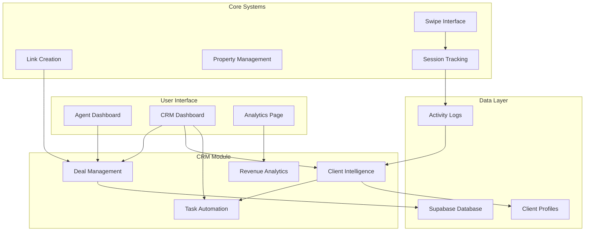

# CRM Module Design & Access Documentation
## SwipeLink Estate - Customer Relationship Management System

---

## Executive Summary

The CRM module in SwipeLink Estate functions as an **intelligent deal management system** that automatically converts property link shares into trackable deal opportunities. Unlike traditional CRM systems that require manual data entry, this system leverages the unique "link-as-deal" paradigm where every shared property collection becomes a potential sale automatically tracked and managed.

### Core Innovation: Link-as-Deal Architecture
- **Automatic Deal Creation**: Links shared with clients instantly become CRM deals
- **Progressive Client Profiling**: Client data enriches from "ghost" to full profile through engagement
- **Behavioral Intelligence**: Swipe patterns automatically generate engagement scores and preferences
- **Automated Workflows**: Task generation based on client behavior without manual intervention

---

## Module Architecture & Access Patterns

### 1. Primary Access Points

#### A. Agent Dashboard Integration (`/dashboard`)
```typescript
Dashboard
├── CRM Summary Widget
│   ├── Active Deals Counter
│   ├── Hot Leads Alert Badge
│   ├── Pending Tasks Count
│   └── Quick Access Button → CRM Dashboard
├── Property Selection → Link Creation
│   └── Automatic Deal Generation (Background Process)
└── Analytics Preview
    └── Deal Pipeline Snapshot
```

**Access Flow:**
1. Agent logs into dashboard
2. CRM widget shows real-time deal status
3. Creating a link automatically creates a CRM deal
4. No separate CRM data entry required

#### B. Dedicated CRM Dashboard (`/crm`)
```typescript
CRM Dashboard
├── Deal Pipeline View (Kanban Board)
│   ├── Created Stage
│   ├── Shared Stage
│   ├── Engaged Stage
│   ├── Qualified Stage
│   ├── Showing Stage
│   └── Closed Stage
├── Client Intelligence Panel
│   ├── Engagement Scores
│   ├── Temperature Classifications
│   ├── Preference Insights
│   └── Behavioral Analytics
├── Task Management Center
│   ├── Today's Tasks
│   ├── Overdue Tasks
│   ├── Upcoming Follow-ups
│   └── Automated Reminders
└── Revenue Analytics
    ├── Pipeline Value
    ├── Conversion Metrics
    └── Performance Insights
```

#### C. Analytics Integration (`/analytics`)
```typescript
Analytics Page
├── CRM Performance Section
│   ├── Deal Conversion Funnel
│   ├── Client Engagement Metrics
│   ├── Task Completion Rates
│   └── Revenue Forecasting
└── Export & Reporting
    └── CRM Data Exports
```

---

## Data Flow & Integration

### 2. Link-to-Deal Conversion Pipeline

```mermaid
graph LR
    A[Agent Creates Link] --> B[Link Shared with Client]
    B --> C[Auto-Create Deal in CRM]
    C --> D[Client Opens Link]
    D --> E[Session Tracking Starts]
    E --> F[Swipe Actions Recorded]
    F --> G[Engagement Score Calculated]
    G --> H[Deal Stage Updated]
    H --> I[Tasks Auto-Generated]
    I --> J[Agent Receives Alerts]
```



### 3. Component Integration Map

```typescript
// Core CRM Services
services/
├── client/
│   ├── ClientService.ts          // Main client management
│   ├── client-profile.service.ts // Profile building
│   ├── client-insights.service.ts // Intelligence generation
│   └── client-similarity.service.ts // Client matching
├── task/
│   ├── TaskService.ts            // Task orchestration
│   ├── task-crud.service.ts      // Task CRUD operations
│   ├── task-automation.service.ts // Automated task generation
│   └── task-query.service.ts     // Task retrieval & filtering
└── deal/
    ├── DealService.ts            // Deal management
    ├── deal.service.ts           // Deal operations
    └── scoring.service.ts        // Engagement scoring

// UI Components
components/
├── analytics/
│   ├── CRMAnalytics.tsx         // Main analytics dashboard
│   ├── SummaryCard.tsx          // KPI displays
│   ├── PipelineVisualization.tsx // Deal pipeline view
│   └── ConversionFunnel.tsx     // Conversion analytics
├── deal-card/
│   ├── DealCard.tsx             // Individual deal display
│   ├── DealCardList.tsx         // Deal list view
│   └── DealCardGrid.tsx         // Deal grid layout
└── task-automation/
    ├── TaskAutomation.tsx        // Task management UI
    ├── TaskCard.tsx              // Task display
    └── TaskList.tsx              // Task list management
```

---

## Access Control & Permissions

### 4. Role-Based Access Matrix

| Feature | Basic Agent | Senior Agent | Team Leader | Admin |
|---------|------------|--------------|-------------|--------|
| View Own Deals | ✅ | ✅ | ✅ | ✅ |
| Create Deals (via Links) | ✅ | ✅ | ✅ | ✅ |
| View Client Intelligence | ✅ | ✅ | ✅ | ✅ |
| Manage Tasks | ✅ | ✅ | ✅ | ✅ |
| View Team Deals | ❌ | ❌ | ✅ | ✅ |
| Export CRM Data | ❌ | ✅ | ✅ | ✅ |
| Configure Automation | ❌ | ❌ | ✅ | ✅ |
| System Configuration | ❌ | ❌ | ❌ | ✅ |

---

## User Workflows

### 5. Primary CRM Workflows

#### Workflow 1: Automatic Deal Creation
```
1. Agent selects properties in dashboard
2. Creates shareable link
3. System automatically:
   - Creates deal record
   - Associates properties
   - Sets initial stage to "Created"
   - Calculates potential value
4. Agent shares link with client
5. Deal stage updates to "Shared"
```

#### Workflow 2: Client Engagement Tracking
```
1. Client opens shared link
2. System creates/updates client profile
3. Each swipe action is recorded:
   - Property liked → Preference captured
   - Property viewed → Engagement scored
   - Session completed → Temperature calculated
4. Deal automatically progresses through stages
5. Agent receives real-time notifications
```

#### Workflow 3: Task Automation
```
1. High engagement detected (score > 80)
2. System generates immediate task: "Call client today"
3. Task appears in agent's dashboard
4. Agent completes task
5. System tracks outcome and adjusts future automation
```

---

## Technical Implementation

### 6. Database Schema

```sql
-- Core CRM Tables (Conceptual - Using Supabase)

-- Deals (Currently using 'links' table)
deals/links {
  id: uuid
  agent_id: uuid
  client_id: uuid (nullable, enriched over time)
  deal_name: string
  deal_status: enum('active', 'qualified', 'nurturing', 'closed-won', 'closed-lost')
  deal_stage: enum('created', 'shared', 'accessed', 'engaged', 'qualified', 'showing', 'negotiating', 'closed')
  deal_value: number
  property_ids: uuid[]
  engagement_score: number (0-100)
  temperature: enum('hot', 'warm', 'cold')
  created_at: timestamp
  updated_at: timestamp
}

-- Tasks (To be implemented)
tasks {
  id: uuid
  deal_id: uuid
  agent_id: uuid
  title: string
  description: string
  type: enum('call', 'email', 'showing', 'follow-up', 'nurture')
  priority: enum('high', 'medium', 'low')
  status: enum('pending', 'completed', 'dismissed')
  due_date: timestamp
  completed_at: timestamp
  is_automated: boolean
}

-- Client Profiles (Progressive enrichment)
client_profiles {
  id: uuid
  name: string (nullable)
  email: string (nullable)
  phone: string (nullable)
  engagement_score: number
  temperature: enum('hot', 'warm', 'cold')
  preferred_property_types: string[]
  price_range: jsonb
  behavioral_profile: jsonb
  first_seen: timestamp
  last_seen: timestamp
}

-- Activities (Client interactions)
activities {
  id: uuid
  session_id: uuid
  deal_id: uuid
  client_id: uuid
  property_id: uuid
  action: enum('viewed', 'liked', 'disliked', 'considered', 'expanded')
  timestamp: timestamp
  duration: integer
  metadata: jsonb
}
```

### 7. API Endpoints (Conceptual)

```typescript
// CRM API Routes
/api/crm/
├── deals/
│   ├── GET    /                 // List deals with filters
│   ├── GET    /:id              // Get deal details
│   ├── POST   /                 // Create deal (auto via link)
│   ├── PATCH  /:id              // Update deal
│   └── GET    /:id/activities   // Get deal activities
├── clients/
│   ├── GET    /:id              // Get client profile
│   ├── GET    /:id/insights     // Get client insights
│   └── GET    /:id/similar      // Find similar clients
├── tasks/
│   ├── GET    /                 // List tasks with filters
│   ├── POST   /                 // Create task
│   ├── PATCH  /:id/status       // Update task status
│   └── GET    /automated        // Get automated tasks
└── analytics/
    ├── GET    /pipeline         // Pipeline analytics
    ├── GET    /conversion       // Conversion metrics
    └── GET    /forecast         // Revenue forecast
```

---

## UI/UX Design Patterns

### 8. CRM Interface Components

#### Deal Card Component
```typescript
<DealCard>
  ├── Header
  │   ├── Client Name / Ghost Profile
  │   ├── Temperature Indicator (🔥/🌡️/❄️)
  │   └── Deal Value
  ├── Body
  │   ├── Property Count & Preview
  │   ├── Engagement Score (0-100)
  │   ├── Last Activity Time
  │   └── Current Stage Badge
  └── Actions
      ├── View Details
      ├── Contact Client
      └── Quick Actions (Call/Email/Task)
</DealCard>
```

#### Pipeline Visualization
```typescript
<PipelineView>
  ├── Kanban Board Layout
  │   ├── Draggable Deal Cards
  │   ├── Stage Columns
  │   └── Quick Filters
  ├── Statistics Bar
  │   ├── Total Pipeline Value
  │   ├── Conversion Rate
  │   └── Average Deal Time
  └── Bulk Actions
      └── Multi-select Operations
</PipelineView>
```

---

## Integration Points

### 9. System Integration Map



---

## Performance Considerations

### 10. Optimization Strategies

#### Real-time Updates
- WebSocket connections for live deal updates
- Optimistic UI updates for task management
- Background sync for engagement scores

#### Data Caching
```typescript
// Client-side caching strategy
const crmCache = {
  deals: new Map(),        // Recent deals
  tasks: new Map(),        // Active tasks
  clients: new Map(),      // Client profiles
  ttl: 5 * 60 * 1000      // 5-minute cache
}
```

#### Lazy Loading
- Progressive deal loading in pipeline view
- On-demand client profile enrichment
- Paginated task lists

---

## Security & Privacy

### 11. Data Protection

#### Client Data Handling
- Progressive disclosure (ghost → partial → full profile)
- Encrypted storage for sensitive information
- GDPR-compliant data retention policies

#### Access Control
- JWT-based authentication (when implemented)
- Row-level security in Supabase
- Audit logging for all CRM actions

---

## Future Enhancements

### 12. Roadmap

#### Phase 1: Foundation (Current)
- ✅ Service architecture
- ✅ Basic UI components
- ⏳ Database schema
- ⏳ API endpoints

#### Phase 2: Integration
- 🔲 Live deal creation from links
- 🔲 Real-time engagement tracking
- 🔲 Automated task execution
- 🔲 Client communication tools

#### Phase 3: Intelligence
- 🔲 AI-powered lead scoring
- 🔲 Predictive analytics
- 🔲 Smart task recommendations
- 🔲 Automated follow-up sequences

#### Phase 4: Scale
- 🔲 Team collaboration features
- 🔲 Multi-agent workflows
- 🔲 Advanced reporting
- 🔲 Third-party integrations

---

## Conclusion

The CRM module in SwipeLink Estate represents a paradigm shift in real estate relationship management. By automatically converting link shares into trackable deals and using client swipe behavior to generate intelligence, the system eliminates manual data entry while providing superior insights. The modular architecture ensures scalability, while the progressive enhancement approach allows for immediate value delivery with room for future sophistication.

### Key Success Factors:
1. **Zero-friction adoption** - Works automatically with existing workflows
2. **Behavioral intelligence** - Learns from actual client actions, not assumptions
3. **Automated workflows** - Reduces agent workload while improving follow-up
4. **Progressive enhancement** - Starts simple, grows sophisticated over time

The CRM module is designed to be the intelligent backbone of SwipeLink Estate, turning every property share into a managed opportunity and every swipe into actionable intelligence.