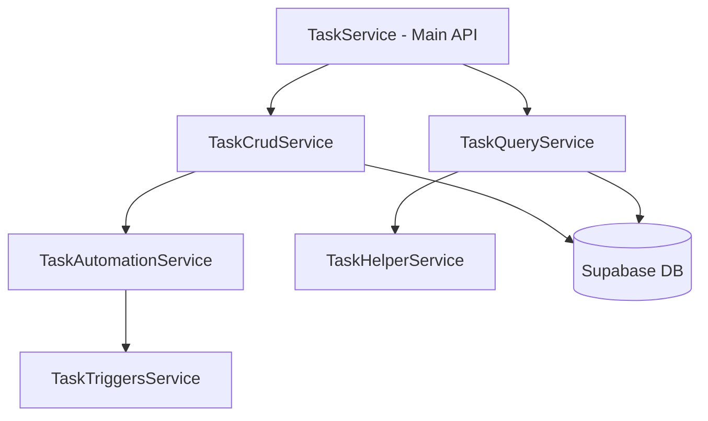

# Task Service Architecture

## Overview

The Task Service module provides comprehensive task management functionality for the CRM system. It has been refactored into a modular architecture following the single responsibility principle and maintaining file sizes under 200 lines.

## Module Structure

```
task.service.ts (98 lines) - Main API Interface
├── task-crud.service.ts (128 lines) - CRUD Operations
├── task-query.service.ts (117 lines) - Query & Filtering
├── task-helper.service.ts (72 lines) - Utility Functions
└── task-automation.service.ts - Automation Logic
    └── task-triggers.service.ts - Trigger-based Tasks
```

## Architecture Flow



## Service Responsibilities

### TaskService (Main Interface)
The main entry point for all task-related operations. Acts as a facade that delegates to specialized services.

**Key Functions:**
- `generateAutomatedTasks()` - Creates automated tasks based on triggers
- `createTask()` - Creates manual tasks
- `updateTaskStatus()` - Updates task status and completion
- `getTasks()` - Retrieves paginated tasks with filters
- `getUpcomingTasks()` - Gets tasks due within specified days
- `getOverdueTasks()` - Gets overdue tasks for an agent

### TaskCrudService (CRUD Operations)
Handles Create, Read, Update, Delete operations for tasks.

**Responsibilities:**
- Task creation and validation
- Task persistence to database
- Status updates and completion tracking
- Data transformation between Task and Activity records

### TaskQueryService (Query Operations)
Manages complex queries, filtering, and retrieval of tasks.

**Responsibilities:**
- Paginated task retrieval with filters
- Specialized queries (upcoming, overdue, high priority)
- Client and property-specific task queries
- Date range filtering

### TaskHelperService (Utilities)
Provides utility functions for date calculations and formatting.

**Responsibilities:**
- Date arithmetic (add days/hours/minutes)
- Due date formatting for display
- Overdue and due-soon checks
- Days between calculation

## Data Flow

### Task Creation Flow
```
1. Client calls TaskService.createTask()
2. TaskService delegates to TaskCrudService
3. TaskCrudService validates input
4. Generates unique task ID
5. Persists to Supabase 'activities' table
6. Returns created Task object
```

### Task Query Flow
```
1. Client calls TaskService.getTasks(filters)
2. TaskService delegates to TaskQueryService
3. TaskQueryService builds Supabase query
4. Applies filters (status, priority, agent, date range)
5. Executes paginated query
6. Transforms Activity records to Task objects
7. Returns PaginatedResponse<Task>
```

### Automated Task Generation Flow
```
1. Trigger event occurs (link accessed, high engagement, etc.)
2. TaskService.generateAutomatedTasks() called
3. Delegates to TaskAutomationService
4. Evaluates automation rules
5. Generates tasks based on triggers and deal state
6. Returns array of automated tasks
```

## Database Schema

Tasks are stored in the `activities` table with action='task_created':

```sql
activities table:
- id: UUID (task ID)
- link_id: UUID (deal ID)
- action: 'task_created'
- metadata: JSONB (Task object)
- created_at: timestamp
```

## Testing

Each service has corresponding test files following TDD principles:
- Uses shared test infrastructure from `/test/`
- Mock factories for consistent test data
- Coverage targets: 70%+ for all services

## Performance Considerations

- **Pagination**: Default limit of 20 tasks per page
- **Query Optimization**: Uses indexed columns for filtering
- **Date Calculations**: Cached where possible
- **Batch Operations**: Support for bulk task creation

## Error Handling

- Validation errors throw with descriptive messages
- Database errors are caught and re-thrown with context
- Null checks prevent undefined behavior
- Graceful fallbacks for missing data

## Future Enhancements

1. **Task Templates**: Pre-defined task templates for common scenarios
2. **Recurring Tasks**: Support for repeating tasks
3. **Task Dependencies**: Link tasks that depend on others
4. **Bulk Operations**: Batch update/delete capabilities
5. **Smart Scheduling**: AI-powered task scheduling optimization