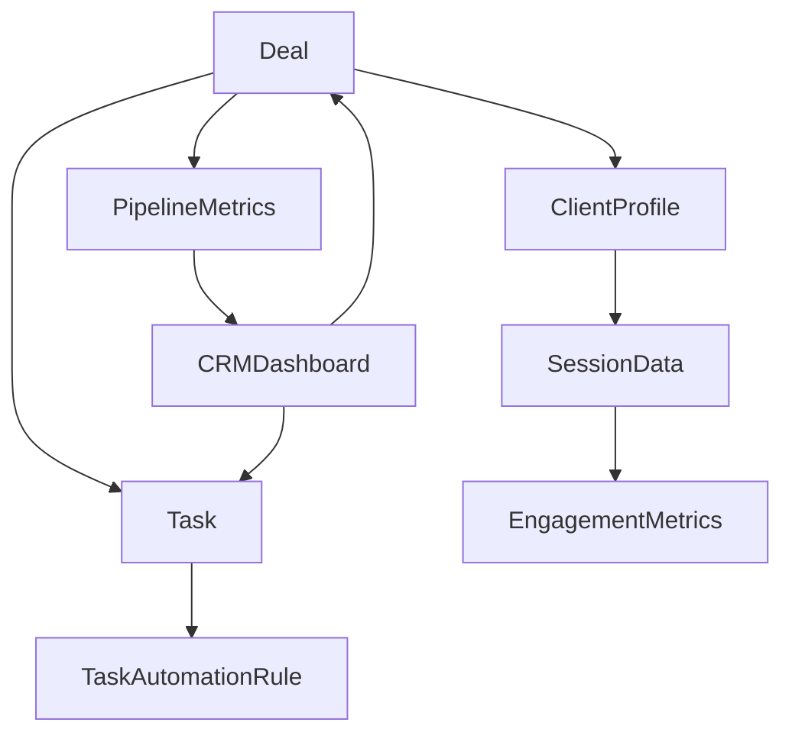

# CRM Types Architecture

## Overview

The CRM type system has been refactored into a modular architecture to maintain file sizes under 200 lines and improve maintainability. Types are organized by domain responsibility.

## Module Structure

```
types.ts (15 lines) - Main re-export file
└── types/
    ├── index.ts (20 lines) - Central export hub
    ├── deal.types.ts (65 lines) - Deal entities and filters
    ├── client.types.ts (76 lines) - Client profiles and engagement
    ├── task.types.ts (103 lines) - Tasks and automation rules
    ├── dashboard.types.ts (62 lines) - Analytics and dashboards
    └── api.types.ts (17 lines) - API response structures
```

## Type Categories

### Deal Types (`deal.types.ts`)

Core deal management types that extend the link-as-deal architecture.

**Key Types:**
- `Deal` - Main deal entity with client, property, and engagement data
- `DealStatus` - Deal lifecycle status (active, qualified, nurturing, closed)
- `DealStage` - Deal progression stages (created → shared → engaged → closed)
- `ClientTemperature` - Lead temperature classification (hot, warm, cold)
- `DealFilters` - Search and filtering parameters for deals

### Client Types (`client.types.ts`)

Client profiles and behavioral tracking types.

**Key Types:**
- `ClientProfile` - Comprehensive client data with preferences and behavior
- `SessionData` - Client session tracking and engagement metrics
- `EngagementMetrics` - Scoring components for engagement calculation

### Task Types (`task.types.ts`)

Task management and automation configuration types.

**Key Types:**
- `Task` - Core task entity with scheduling and automation flags
- `TaskPriority` - Task urgency levels (urgent, high, medium, low)
- `TaskStatus` - Task completion states (pending, in_progress, completed)
- `TaskType` - Predefined task categories (call, email, showing, etc.)
- `TaskAutomationRule` - Configuration for automated task generation
- `TaskFilters` - Search and filtering parameters for tasks

### Dashboard Types (`dashboard.types.ts`)

Analytics and reporting types for CRM dashboards.

**Key Types:**
- `PipelineMetrics` - Comprehensive pipeline analytics
- `CRMDashboard` - Complete dashboard data structure

### API Types (`api.types.ts`)

Common API response structures used across the CRM module.

**Key Types:**
- `CRMApiResponse<T>` - Standard API response wrapper
- `PaginatedResponse<T>` - Paginated data response structure

## Type Relationships



## Usage Examples

### Importing Types

```typescript
// Import specific types
import { Deal, DealStatus, ClientTemperature } from '@/components/crm/types'

// Import from specific module
import { Task, TaskPriority } from '@/components/crm/types/task.types'

// Import all CRM types
import * as CRMTypes from '@/components/crm/types'
```

### Creating Type-Safe Data

```typescript
const deal: Deal = {
  id: 'deal-123',
  linkId: 'link-456',
  agentId: 'agent-789',
  dealName: 'Beach Property Collection',
  dealStatus: 'active',
  dealStage: 'engaged',
  dealValue: 15000,
  clientTemperature: 'hot',
  engagementScore: 85,
  // ... other required fields
}

const task: Task = {
  id: 'task-001',
  dealId: deal.id,
  agentId: deal.agentId,
  title: 'Follow up on property interest',
  type: 'call',
  priority: 'high',
  status: 'pending',
  isAutomated: true,
  // ... other required fields
}
```

## Adding New Types

When adding new types to the CRM module:

1. **Determine the appropriate module** based on the type's domain
2. **Add the type definition** to the corresponding file
3. **Ensure the file remains under 200 lines**
4. **Export the type** from the module's index if needed
5. **Update this README** with the new type information

## Type Safety Guidelines

1. **Use strict types** - Avoid `any` type
2. **Prefer unions over strings** - Use literal types for known values
3. **Document complex types** - Add JSDoc comments for clarity
4. **Maintain backward compatibility** - Don't break existing type contracts
5. **Use optional properties** - Mark nullable fields with `?`

## Migration Notes

The type system was refactored from a single 292-line file to a modular structure. All existing type imports from `'@/components/crm/types'` continue to work through re-exports, ensuring backward compatibility.